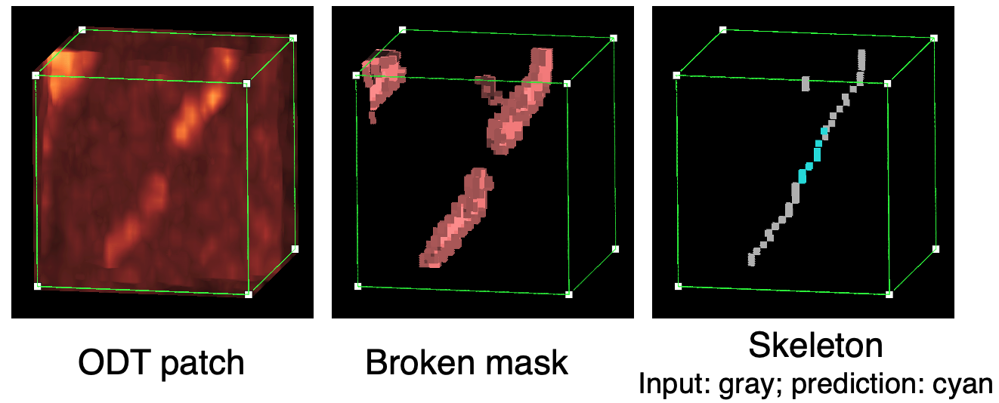

# Self-supervised 3D Skeleton Completion for Vascular Structures

Jiaxiang Ren<sup>1</sup>,
Zhenghong Li<sup>1</sup>,
Wensheng Cheng<sup>1</sup>,
Zhilin Zou<sup>1</sup>,
Kicheon Park<sup>2</sup>,
Yingtian Pan<sup>2</sup>,
Haibin Ling<sup>1</sup>

<sup>1</sup>Department of Computer Science, <sup>2</sup>Department of Biomedical Engineering

Stony Brook University

---



This repository is the official PyTorch implementation of 3D skeleton completion model.

### Environment

```
pytorch == 1.12.1
scikit-image == 0.19.3
napari == 0.4.16
skan == 0.10.0
```

### Inference

Ensure the trained model weight is in `weights/model_weights_best.pth`. Then run the notebook `inference_odt.ipynb` for inference.

### Datasets and Annotations
- MSD dataset can be downloaded from the official site. The annotation is in `dataset/MSD_annotation_3D.csv`. Note that only a part of original CT volumes contain vessels so we crop the volumes using the script in `dataset/task008_hvessel_preprocessing.ipynb`. The annotation is based on the cropped CT patches.

- 10 ODT patches with [ODT image, mask, and skeleton] in `dataset/odt_testing.npy` are provided for 3D visualization. The whole ODT volomes used in this work is not available for now due to data policy.


### Contact

jiaxren@cs.stonybrook.edu

### Acknowledgment

This work was partially supported by NIH grants 1R21DA057699, 1RF1DA048808 and 2R01DA029718, and partially supported by NSF grants 2006665 and 2128350.
